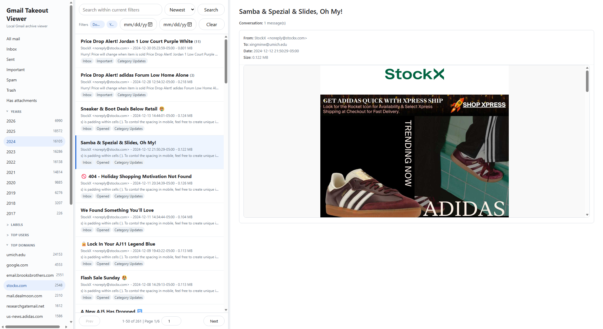

# Gmail Takeout Viewer

[中文说明](README.zh-CN.md)

A local-only viewer for Gmail Takeout MBOX exports. It imports an MBOX into a SQLite index plus local archive files, then serves a Gmail-like browser UI on `127.0.0.1`.

The repository contains only application code and documentation. Real mail data, SQLite indexes, attachments, raw `.eml` files, and local config are intentionally ignored by git.



## Project Status

This project is usable for local personal archives and is packaged as an early public release. Treat it as a local desktop tool, not a hosted multi-user webmail service.

Security and privacy notes are in `SECURITY.md`.

## Requirements

- Python 3.9 or newer
- No pip packages are required

The app uses only Python standard-library modules.

Optional editable install:

```sh
python -m pip install -e .
```

This exposes command-line entry points:

```text
gmail-takeout-import
gmail-takeout-viewer
gmail-takeout-stats
```

## Quick Start

1. Copy the sample config:

```sh
cp config.example.json config.json
```

On Windows PowerShell:

```powershell
Copy-Item config.example.json config.json
```

2. Edit `config.json` and set your own account email addresses:

```json
{
  "account_emails": [
    "your-address@example.com"
  ],
  "top_user_include_patterns": [
    "%.edu"
  ],
  "top_user_exclude_patterns": [
    "noreply",
    "no-reply",
    "donotreply",
    "newsletter",
    "promo",
    "marketing",
    "offers",
    "rewards",
    "shop",
    "notification"
  ]
}
```

`account_emails` is used to infer Sent/Received behavior and hide your own addresses from Top users. `top_user_include_patterns` and `top_user_exclude_patterns` are SQLite `LIKE` patterns used to tune the Top users list for your archive. Remove `top_user_include_patterns` or set it to `[]` to show all non-excluded senders/recipients.

3. Import an MBOX. Compact storage is the default: message body HTML is stored in SQLite, raw `.eml` files are not copied per message, MBOX byte offsets are indexed, and attachments are deduplicated into `blobs/aa/bb/<sha256>.blob`:

```sh
python -B import_mbox.py "/path/to/all-mail.mbox" --rebuild
```

On Windows:

```powershell
py -B import_mbox.py "C:\path\to\all-mail.mbox" --rebuild
```

Production import with progress, validation, and a final summary:

```powershell
py -B import_mbox.py "C:\path\to\all-mail.mbox" --rebuild --progress 1000 --commit-every 500
```

To use the old file-per-message layout, add `--storage legacy` (or `--legacy`). Legacy mode writes `messages/000001/body.html`, `messages/000001/raw.eml`, and per-message attachment files.

If an import is interrupted, continue from the largest message id already stored:

```powershell
py -B import_mbox.py "C:\path\to\all-mail.mbox" --resume --progress 1000 --commit-every 500
```

If a small number of messages failed and you want to repair only those MBOX indexes after fixing the importer:

```powershell
py -B import_mbox.py "C:\path\to\all-mail.mbox" --resume --only-indexes 35472,35475
```

For testing a larger sample without replacing the current data:

```powershell
py -B import_mbox.py "C:\path\to\all-mail.mbox" --out-dir ".\test_import_20000" --rebuild --limit 20000 --progress 2000
$env:GMAIL_VIEWER_DATA_DIR = ".\test_import_20000"
py -B app.py
```

Import reports are written under `reports/`, including `import_summary.json` and `import_errors.jsonl` when parsing errors occur.

4. Start the viewer.

On Windows, double-click:

```text
start.bat
```

On Windows with bundled portable Python, double-click:

```text
start_portable.bat
```

To install the bundled Windows Python runtime into `runtime/python-windows-x64`, run once:

```powershell
powershell -ExecutionPolicy Bypass -File tools\bootstrap_portable_windows.ps1
```

On macOS, double-click:

```text
start.command
```

If macOS says the file is not executable, run this once in Terminal from the project folder:

```sh
chmod +x start.command
```

On macOS or Linux from Terminal:

```sh
sh start.sh
```

Cross-platform Python entrypoint:

```sh
python -B start.py
```

If installed with `pip install -e .`:

```sh
gmail-takeout-viewer
```

Portable relative launcher entrypoint:

```sh
python -B portable/launch.py --data-dir .
```

The `portable/` folder also includes `launch.bat`, `launch.command`, and `launch.sh`. These resolve paths relative to the application folder, set `GMAIL_VIEWER_DATA_DIR`, start the local app, and let `app.py` open the browser. Move the whole folder together with `gmail_index.sqlite` and `blobs/` to keep a portable archive.

The app starts a local web server on `127.0.0.1` using an automatically selected free port, then opens your browser. Press `Ctrl+C` to stop it.

To open data stored outside the source folder, set `GMAIL_VIEWER_DATA_DIR` before launching the app.

## Files

Tracked source files:

```text
app.py                 Local web app and browser UI
import_mbox.py         Imports a Gmail Takeout MBOX into the viewer format
analyze_mbox_stats.py  Header-only MBOX statistics without extracting message bodies
portable/              Relative-path launchers for portable archives
start.bat              Windows launcher
start_portable.bat     Windows launcher using bundled runtime/python-windows-x64 when present
start.command          macOS double-click launcher
start.sh               macOS/Linux launcher
start.py               Cross-platform Python entrypoint
config.example.json    Example local account config
requirements.txt       Notes that no packages are required
tools/                 Helper scripts for building portable runtime folders
```

Generated local data, ignored by git:

```text
config.json
gmail_index.sqlite
gmail_index.sqlite-shm
gmail_index.sqlite-wal
messages/
blobs/
runtime/
*.mbox
*.eml
```

## Features

- Conversation-based browsing
- Local search over subject, sender, recipients, labels, preview, and body text
- Sorting by newest, oldest, or largest, with optional date range filtering
- Filters for Inbox, Sent, Important, Spam, Trash, year, Gmail label, sender domain, and attachments
- Top users filter for frequent senders/recipients, excluding your configured account emails and optional sender patterns
- Page jump controls for conversation results
- Resizable sidebar, conversation list, and message detail columns
- Indexed filters and optimized conversation list queries for larger archives
- Active filter chips, clearable filter state, and loading feedback while large queries run
- HTML body display
- Extracted attachment links
- Compact storage by default, with legacy `raw.eml` preservation available via `--storage legacy`

## Search Syntax

The search box supports plain keywords and a small Gmail-like operator set:

```text
review deadline
from:example.edu
to:your-address@example.com
subject:review
label:Important
category:Promotions
has:attachment
larger:10M
smaller:500K
older:2025-01-01
newer:2024-01-01
year:2026
```

Operators can be combined:

```text
from:example.edu subject:review has:attachment
category:Promotions older:2025-01-01
larger:5M invoice
```

This is not Gmail's full search language. It is a local SQLite-backed subset designed for browsing a Takeout archive.

## Data Model

SQLite stores searchable and sortable metadata:

```text
messages
attachments
message_labels
conversation_index
conversation_labels
conversation_filters
message_users
messages_fts
```

Compact mode, the default, stores searchable metadata, body text, and display HTML in SQLite, records the source MBOX path/offset/length for each message, and stores attachments as deduplicated blobs:

```text
gmail_index.sqlite
blobs/aa/bb/<sha256>.blob
```

Compact mode intentionally does not create `messages/000001/` directories or copy `raw.eml` files for every email. Keep the original MBOX as the source-of-truth backup; a raw-message export tool can use the stored MBOX offsets later.

Legacy mode keeps large display files on disk:

```text
messages/000001/body.html
messages/000001/attachments/...
messages/000001/raw.eml
```

Legacy mode keeps the database smaller and makes attachments easy to inspect per message, but it creates many files.

The app automatically creates or refreshes derived performance tables such as `message_labels`, `conversation_index`, `conversation_labels`, `conversation_filters`, and `message_users` when opening an existing database. The first launch after an import may spend time building these indexes; later All Mail, label, year, domain, and Top users lists should be much faster. Plain keyword searches use SQLite FTS; Gmail-like operator searches use the local SQL subset described above.

## Conversations

MBOX stores individual messages. Gmail's conversation view is a UI grouping built from headers such as:

```text
Message-ID
In-Reply-To
References
Subject
```

The importer stores `in_reply_to`, `references_text`, and `thread_key`. Conversation mode groups messages by `thread_key` and opens all messages in that thread in chronological order. This approximates Gmail conversations, but Gmail's internal thread id is not included in a normal Takeout MBOX, so edge cases may differ from Gmail.

## Information Preservation

Keep the original MBOX as the source-of-truth backup.

The importer preserves enough data for local viewing and later export:

- searchable metadata in SQLite
- searchable plain text body in SQLite
- sanitized HTML body for display, in SQLite for compact mode or as `body.html` for legacy mode
- extracted attachments as deduplicated blob files in compact mode or per-message files in legacy mode
- raw RFC 822 message bytes as `raw.eml` only in legacy mode; compact mode stores MBOX source path, byte offset, and byte length instead
- the original MBOX `From ` separator line in SQLite
- thread metadata from `In-Reply-To` and `References`

The viewer display is intentionally simplified and sanitized. It does not preserve the exact original MBOX byte stream as one file. With `raw.eml` plus the saved MBOX separator line, messages can be exported back into an MBOX-like file later, but the safest lossless backup remains the original `.mbox` file.

## Privacy

Do not commit generated data. The `.gitignore` is intentionally strict so mail data, attachments, SQLite indexes, raw `.eml` files, MBOX files, and local config stay out of the repository.
