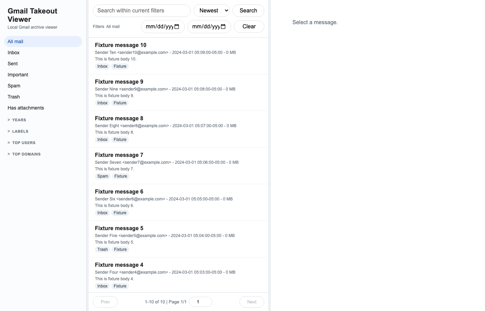

# Gmail Takeout Archive Builder

[中文说明](README.zh-CN.md)

This repository builds a portable, self-sufficient local mail archive folder from a Gmail Takeout `.mbox` file.

It is not the archive itself, and it is not meant to be the folder you launch every day. The generated output folder contains its own app copy, launchers, SQLite index, source MBOX copy, attachments, reports, and logs. After generation, that folder can be moved or opened without this repository. Opening the generated archive still requires Python 3.9 or newer on that machine.

## Basic Usage

Build an archive from a Gmail Takeout MBOX:

```sh
python -B tools/build_archive.py "/path/to/all-mail.mbox" --out "/path/to/MailArchive" --rebuild
```

Open the generated folder:

```text
MailArchive/
  .mail-archive-builder.json  marker used for safe rebuilds
  Start Mail Viewer.command   macOS double-click launcher
  Start Mail Viewer.sh        macOS/Linux terminal launcher
  Start Mail Viewer.bat       Windows launcher
  app/                        copied viewer/importer code
  data/                       SQLite index, reports, blobs
  source/                     copied source MBOX
  logs/                       import log
```

The viewer runs only on `127.0.0.1` and opens in your local browser. It is not hosted on a public website.

## Small Example

This repo includes a fake 10-message MBOX and a generated sample archive:

```text
examples/sample_10.mbox
examples/sample_archive/
```

Regenerate the sample archive:

```sh
python -B tools/build_archive.py examples/sample_10.mbox --out examples/sample_archive --rebuild --limit 10
```

Then open `examples/sample_archive/Start Mail Viewer.command` on macOS, or run:

```sh
sh examples/sample_archive/Start\ Mail\ Viewer.sh
```

The checked-in sample output is self-contained:

```text
examples/sample_archive/
  .mail-archive-builder.json
  Start Mail Viewer.command
  Start Mail Viewer.sh
  Start Mail Viewer.bat
  app/
    app.py
    import_mbox.py
    analyze_mbox_stats.py
    portable_launch.py
  data/
    gmail_index.sqlite
    reports/import_summary.json
  logs/
    import.log
  source/
    sample_10.mbox
```



## Useful Options

Import only the first N messages:

```sh
python -B tools/build_archive.py input.mbox --out MailArchive --rebuild --limit 100
```

Use compact storage, the default:

```sh
python -B tools/build_archive.py input.mbox --out MailArchive --rebuild --storage compact
```

Use legacy file-per-message storage:

```sh
python -B tools/build_archive.py input.mbox --out MailArchive --rebuild --storage legacy
```

For lower-level repair or resume workflows, use the importer directly:

```sh
python -B viewer/import_mbox.py input.mbox --out-dir MailArchive/data --resume --progress 1000 --commit-every 500
```

## Repository Scope

The repository contains the builder, importer, viewer source copied into generated archives, tests, and examples.

The repository should not contain real mail data. Real Gmail exports, generated private archives, SQLite databases, attachments, and local config files are ignored by default. Tracked `.mbox` files are fake examples under `examples/`.

Tracked source files:

```text
tools/build_archive.py     Main program: builds a standalone archive folder
tools/archive_templates/   Launcher and portable launch templates copied into archives
viewer/app.py              Copied into generated archives as app/app.py
viewer/import_mbox.py      Copied into generated archives and used for import
viewer/analyze_mbox_stats.py Header-only MBOX statistics helper
examples/                  Fake sample input and generated sample archive
tests/                     End-to-end and importer tests
```

## Development Test

Run the end-to-end tests:

```sh
python -m unittest tests.test_compact_archive tests.test_build_archive_e2e
```

The end-to-end test builds a standalone archive from `examples/sample_10.mbox`, starts the generated app on localhost, and verifies that the browser page and conversation API work.
